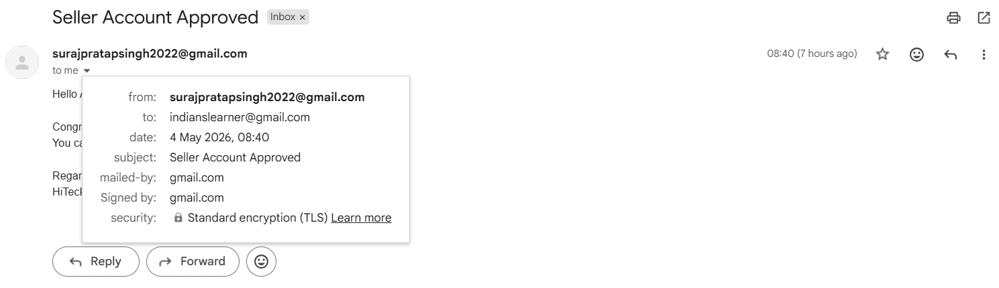

# Multi-Vendor E-commerce Platform

A full-stack **Multi-Vendor E-commerce Platform** built using **ReactJS** for frontend and **Spring Boot** for backend.

## Tech Stack

### Frontend

- ReactJS
- Bootstrap
- Axios
- React Router

### Backend

- Java
- Spring Boot
- Spring Security
- Spring Data JPA / Hibernate
- MySQL / H2 Database
- Maven

### Tools

- Postman
- Git & GitHub
- VS Code
- STS / Eclipse

---

## Main Features

- Customer registration and login
- Seller registration and approval system
- Admin seller verification
- Product add, update, delete, and listing
- Product search and filter
- Cart management
- Order placement
- Razorpay payment gateway integration
- Password reset using email
- Seller approval notification by email
- Light and dark theme UI
- Role-based access control

---
```
## Project Structure

Multivendor-Ecommerce-System/
│
├── Ecommerce-Backend/
├── Ecommerce-Frontend/
│
└── README.md
```
---
## Project Screenshots

### 1. Home Page


### 2. Dark Theme Home Page


### 3. Customer Register


### 4. Login Page


### 5. Send Password Reset Link


### 6. Password Reset Link Received


### 7. Password Reset Window


### 8. Seller Register


### 9. Seller Verification Window


### 10. Admin Approved Seller


### 11. Seller Email Notification After Approved





### 12. Admin Homepage Edit


### 13. Seller Listed Products


### 14. Seller Update Product


### 15. Customer Adding Product in Cart


### 16. Razorpay Payment Gateway


### 17. Razorpay Payment Option


### 18. Razorpay Payment Processing


### 19. Razorpay Payment ID Generated


### 20. Website Payment Successful Done


---

